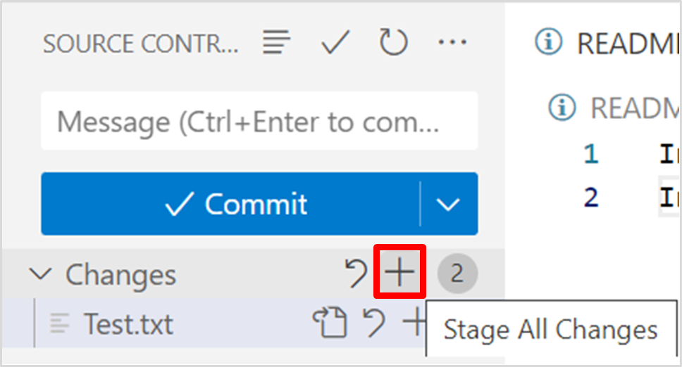

# Jobsheet 4
1. Check if the Test.txt file exists on GitHub. If not, why not?
* It doesn’t exist because we did not compile and push it to the remote repository.

2. Explain the functions of Add, Commit, and Push.
* Add is for preparing the changes that we want to save, Commit is for saving those changes to your local history, Push is for uploading it to the remote repository. 

3. Add Test.txt. To add all changes made, use the + icon to the right of Changes. Stage all changes, then Commit and Push..
* 
* 